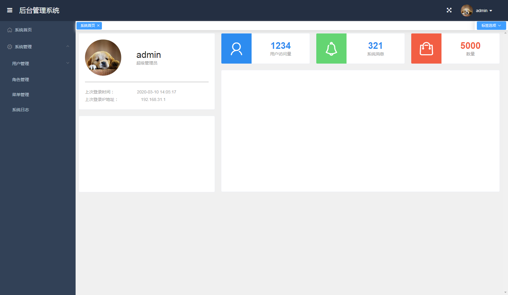

# manage 后台管理系统脚手架

## 前端

基于 Vue + Element UI 的后台管理系统解决方案。[线上地址](http://home.zhaobaoge.com:8003/admin/#/)

## 后端

基于 CodeIgniter 3.1.10 登录认证基于 jwt

## 项目截图

### 登录


### 首页



## 赞赏

请作者喝杯咖啡吧！(微信号：S281431280)


## 特别鸣谢

- [vue-manage-system](https://github.com/lin-xin/vue-manage-system)

## 功能

- [x] 登录/注销
- [x] Dashboard
- [x] 用户管理
- [x] 角色管理
- [x] 菜单管理
- [ ] 系统日志

## 安装步骤

```
git clone git@github.com:fxueye/manage.git
// 把项目下载到本地
cd manage/manage    // 进入前台
npm install         // 安装项目依赖，等待安装完成之后，安装失败可用 cnpm 或 yarn

// 开启服务器，浏览器访问 http://localhost:8080
npm run serve

// 执行构建命令，生成的dist文件夹放在服务器下即可访问
npm run build


server 目录是php CodeIgniter 项目目录
```

前端的修改添加内容可参考 [vue-manage-system](https://github.com/lin-xin/vue-manage-system)

## License

[MIT](https://github.com/lin-xin/vue-manage-system/blob/master/LICENSE)
